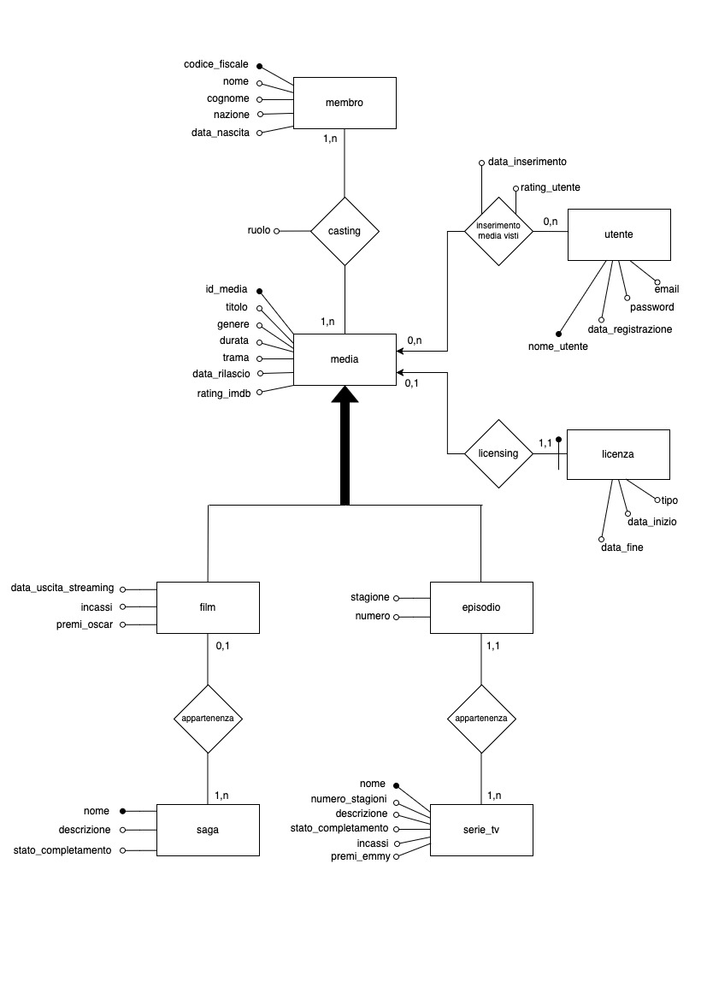
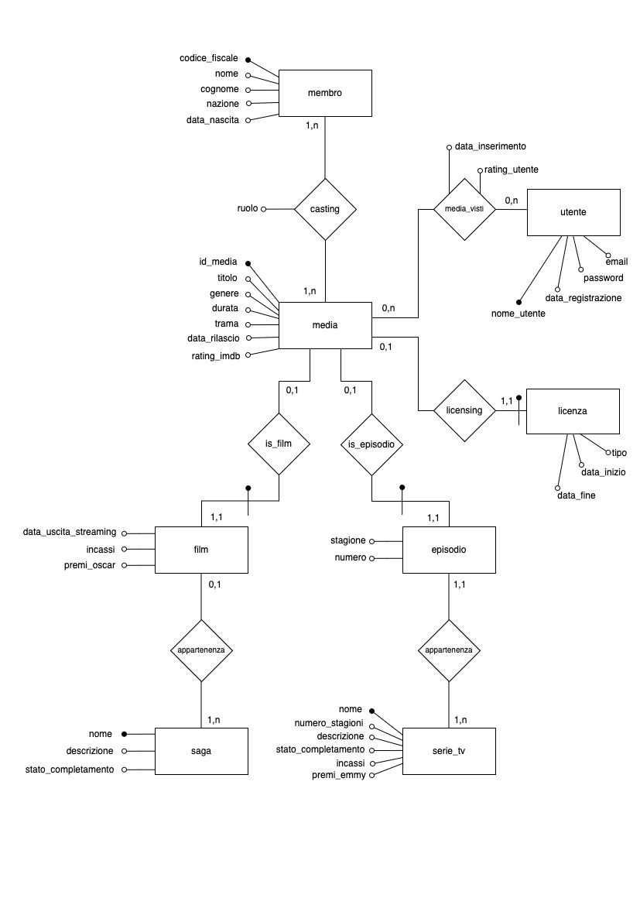
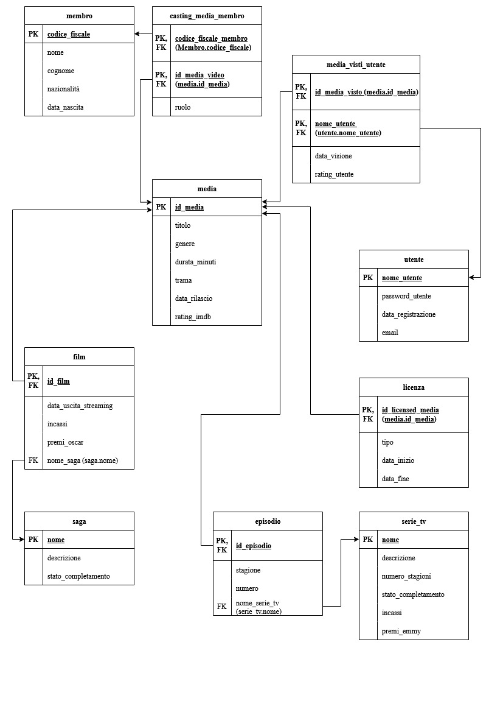

# Relazione Basi Dati 2025

# Database per la gestione di una piattaforma streaming di Film e Serie Tv

> ***Luca Slongo** (2111009), **Alexandru Mitu** (2101083)*
> 

## 1 Abstract

Il presente progetto mira a sviluppare una base di dati per gestire una piattaforma di streaming, amministrando un catalogo multimediale di film, serie TV, episodi, saghe, membri del cast e utenti. La struttura del database classifica i diversi tipi di contenuti con informazioni specifiche: gli episodi sono collegati a stagioni e serie TV, mentre i film possono appartenere a saghe (come "Il Signore degli Anelli").

Il sistema registra metadati essenziali come titolo, genere, durata, trama, data di rilascio e valutazioni IMDb. Inoltre, mantiene uno storico delle visioni degli utenti con data e valutazione personale, permettendo alla piattaforma di fungere da libreria personale dei contenuti visti.

L'implementazione utilizza PostgreSQL, comprende script per il popolamento iniziale e query di estrazione. L'applicazione dimostrativa permette agli utenti di esplorare il catalogo multimediale in modo interattivo.

---

## 2 Analisi dei Requisiti

1. **Utente**
    - può registrarsi, effettuare login, visualizzare il catalogo, filtrare per genere, consultare dettagli e lasciare valutazioni e segnare i media che ha visto
2. **Gestione media**
    - Inserimento, modifica e cancellazione di film e serie TV.
    - Per le serie TV, gestione di stagioni ed episodi.
3. **Gestione Saghe**
    - Definizione di saghe e associazione dei film ad esse.
4. **Gestione Serie TV**
    - Definizione di serie tv e associazione degli episodi
5. **Gestione Licenze**
    - I media possono avere o meno una licenza, le licenze presenti nel database devono avere per forza un media a cui sono assegnate.
    - I valori possibili da assegnare alle licenze sono specificati nella creazione della tabella `licenza`
6. **Gestione Membri del Cast**
    - Memorizzazione di registi, attori, sceneggiatori e produttori, con i loro dati anagrafici e le relazioni con i media.
    - I possibili ruoli che un membro può avere sono specificati nella tabella `casting_media_membro` che gestisce la relazione tra i membri ed il media

---

## 3 Progettazione Concettuale

Il modello Entità-Relazione individuato comprende le seguenti entità principali:

- **Media** (film o episodio), con attributi: *ID*, *Titolo*, *Genere*, *Data rilascio*, *Durata in minuti*, *Trama*, *Rating IMDB*.
- **Saga**, con *Nome* e *Descrizione*.
- **Serie_TV**, con *Nome*, *Numero stagioni*, *Stato completamento*, *Incassi*, *Premi Emmy*.
- **Film** e **Episodio**, specializzazioni di **Media**, collegate tramite foreign key.
- **Membro**, con *Codice Fiscale*, *Nome*, *Cognome*, *Nazionalità*, *Data di nascita*.
- **Utente**, con *Username*, *Password*, *Email*, *Data registrazione*.
- **Licenza**, relazione uno-a-uno con *ID media*, *Tipo*, *Date inizio/fine*.
- **Casting_Media_Membro**, relazione molti-a-molti tra Media e Membro con ruolo.
- **Media_Visti_Utente**, relazione molti-a-molti tra Media e Utente con data visione e valutazione utente.

Lo schema relazionale base si può vedere nella *Figura 1* sottostante.



Figura 1: Diagramma E-R del database

---

## 4 Progettazione Logica

### 4.1 Analisi delle Ridondanze

Nello schema concettuale compare, per ***episodio***, il campo `numero_stagioni` che risulta ridondante in quanto questa informazione è ricavabile selezionando la stagione massima fra tutti gli episodi, infatti se gli episodi con la stagione più alta hanno 3 come valore, vuol dire che quella serie tv ha 3 stagioni. 

In questo caso la ridondanza è stata mantenuta per favorire, secondo noi, la semplicità e la leggibilità delle interrogazioni, rendendo più immediato l’accesso a determinate informazioni senza dover ricorrere a join complessi, facilitando così anche eventuali query in futuro.

### 4.2 Eliminazione delle Generalizzazioni

Le specializzazioni ***film*** ed ***episodio*** di ***media*** sono state implementate mantenendo separati i costrutti in due tabelle con chiave primaria coincidente (`id_media`), in modo da minimizzare valori nulli e rispettare l’integrità referenziale. La scelta di non unire tutto in un’unica tabella evita colonne inutilizzate e semplifica l’inserimento di nuovi tipi di media.

Nella pratica l’eliminazione della generalizzazione è stata fatta aggiungendo due relazioni ***is_film*** ed ***is_episodio.***

Lo schema risultante dopo l’eliminazione della generalizzazione è nella *Figura 2* sottostante.



Figura 2: Diagramma E-R con generalizzazione su media normalizzata

### 4.3 Schema Relazionale

- media: (id_media PK, titolo, genere, durata_minuti, trama, data_uscita, rating_imdb)
- saga: (nome PK, descrizione, stato_completamento)
- serie_tv: (nome PK, descrizione, numero_stagioni, stato_completamento, incassi, premi_emmy)
- film: (id_film PK FK, data_uscita_streaming, incassi, premi_oscar, nome_saga FK)
    - id_film references media.id_media
    - nome_saga references saga.nome
- episodio: (id_episodio PK FK, stagione, numero, nome_serie_tv FK)
    - id_episodio references media.id_media
    - nome_serie_tv references serie_tv.nome
- membro: (codice_fiscale PK, nome, cognome, nazionalità, data_nascita)
- utente: (nome_utente PK, password_utente, email, data_registrazione)
- licenza: (id_licensed_media PK FK, tipo, data_inizio, data_fine)
    - id_licensed_media references media.id_media
- casting_media_membro: (id_media_casting PK FK, codice_fiscale_membro PK FK, ruolo)
    - id_media_casting references media.id_media
    - codice_fiscale_membro references membro.codice_fiscale
- media_visti_utente: (id_media_visto PK FK, nome_utente PK FK, data_visione, rating_utente)
    - id_media_visto references media.id_media
    - nome_utente references utente.nome_utente

Le relazioni tra queste entità si possono visualizzare meglio nella *Figura 3* sottostante.



Figura 3: Schema E-R con tabelle contenenti chiavi primarie (PK) ed esterne (FK)

## 5 Implementazione in PostgreSQL e Definizione delle Query

Nel file `basi.sql` sono inclusi gli script di creazione tabelle, popolamento dati e le seguenti query di esempio.

### 5.1 Definizione delle Query

**Trova l'utente/gli utenti che ha/hanno visto più media** 

```jsx
SELECT nome_utente, numero
FROM (
    SELECT nome_utente, COUNT(*) AS numero
    FROM media_visti_utente
    GROUP BY nome_utente
) AS sub
WHERE numero = (
    SELECT MAX(numero)
    FROM (
        SELECT COUNT(*) AS numero
        FROM media_visti_utente
        GROUP BY nome_utente
    ) AS counts
);
```

**Dato il rating restituisce le serie tv con valutazione maggiore o uguale (parametrica)**

```jsx
SELECT *
FROM (
    SELECT nome_serie_tv AS serie_tv, AVG(rating_imdb) AS media_rating_episodi
    FROM episodio
    INNER JOIN serie_tv ON episodio.nome_serie_tv = serie_tv.nome
    INNER JOIN media ON media.id_media = episodio.id_episodio
    GROUP BY nome_serie_tv
) AS tabella
WHERE media_rating_episodi >= 7.5;
```

`*7.5` è un valore arbitrario, la query va fatta con il valore inserito dall’utente*

**Dato un numero di incassi restituisce i film con introiti maggiori o uguali (parametrica)**

```jsx
SELECT titolo, incassi
FROM media
INNER JOIN film ON media.id_media = film.id_film
WHERE incassi >= 500000000;
```

`*500000000` è un valore arbitrario, la query va fatta con il valore inserito dall’utente*

**Dato un numero di episodi restituisce le serie tv almeno quel numero episodi (parametrica)**

```jsx
SELECT nome_serie_tv, COUNT(id_episodio) AS numero_episodi
FROM episodio
INNER JOIN serie_tv ON episodio.nome_serie_tv = serie_tv.nome
INNER JOIN media ON media.id_media = episodio.id_episodio
GROUP BY nome_serie_tv
HAVING COUNT(id_episodio) >= 3;
```

`*3` è un valore arbitrario, la query va fatta con il valore inserito dall’utente*

**Trova tutti gli episodi di serie tv e film dove ha partecipato Dario Valenti**

```jsx
SELECT media.titolo, casting_media_membro.ruolo, serie_tv.nome AS nome_serie_tv
FROM membro
INNER JOIN casting_media_membro ON membro.codice_fiscale = casting_media_membro.codice_fiscale_membro
INNER JOIN media ON media.id_media = casting_media_membro.id_media_casting
LEFT JOIN episodio ON media.id_media = episodio.id_episodio
LEFT JOIN serie_tv ON episodio.nome_serie_tv = serie_tv.nome
WHERE membro.codice_fiscale = 'VLNTDR81D22F205Y';
```

*Il codice fiscale di Dario Valenti è un valore arbitrario, tuttavia la query non è stata fatta in modo parametrico in quanto sarebbe risultato innaturale per l’utente inserire il codice fiscale a mano. Per realizzare una cosa del genere un approccio sarebbe stato di inserire nome e cognome del membro e qualora vi fossero duplicati far fare un’ulteriore scelta all’utente per selezionare la persona giusta, ma sarebbe stato eccessivo a nostro parere.*

**Mostra tutti i media che hanno un rating medio sulla piattaforma più alta del raing su imdb**

```jsx
SELECT m.titolo AS titolo_media,s.nome AS titolo_serie_tv,
    AVG(mvu.rating_utente) AS media_voti_utenti, m.rating_imdb
FROM media m
JOIN media_visti_utente mvu ON m.id_media = mvu.id_media_visto
LEFT JOIN episodio e ON m.id_media = e.id_episodio
LEFT JOIN serie_tv s ON e.nome_serie_tv = s.nome
GROUP BY m.id_media, m.titolo, s.nome, m.rating_imdb
HAVING AVG(mvu.rating_utente) > m.rating_imdb;
```

### 5.2 Creazione degli Indici

Gli indici più appropriati per questo progetto a nostro avviso erano i seguenti:

```jsx

CREATE INDEX idx_episodio_nome_serie_tv ON episodio(nome_serie_tv);
```

L’indice è stato scelto su `nome_serie_tv` perché questa colonna verrà probabilmente usata frequentemente per effettuare join o filtrare gli episodi relativi a una determinata serie TV (ad esempio, per visualizzare tutti gli episodi di "Suits" o "Chronos"). Aggiungendo un indice su questo campo si migliora significativamente la velocità delle query che lo utilizzano nei `WHERE`, `JOIN`, o `GROUP BY`. L’indice riduce il costo di accesso alle righe della tabella, specialmente in dataset di grandi dimensioni. 

## 6 Interfaccia Applicativa in C

Allo scopo di simulare un’interfacciamento di base con il database dal punto di vista dell’utente è stata realizzato uno script in C che utilizza la libreria `libpq-fe.h` provvista da PostgreSql per collegarsi ad un qualsiasi server SQL locale definendo le credenziali nello script stesso impostando i valori di `DB_NAME`, `USER`, `PASSWORD` .

Lo script permette all’utente di interagire con le query elencate nel punto [5.2](https://www.notion.so/Relazione-Basi-Dati-2025-200f465ad20d809bb6b6cdff38ea6593?pvs=21), permettendo di inserire i parametri qualora queste fossero parametriche.


Schermata iniziale dello script


Output dopo aver eseguito la query 6

Per andare avanti ed eseguire altre query inserire `y` altrimenti terminare l’esecuzione con `n` .